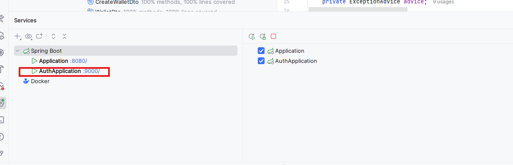
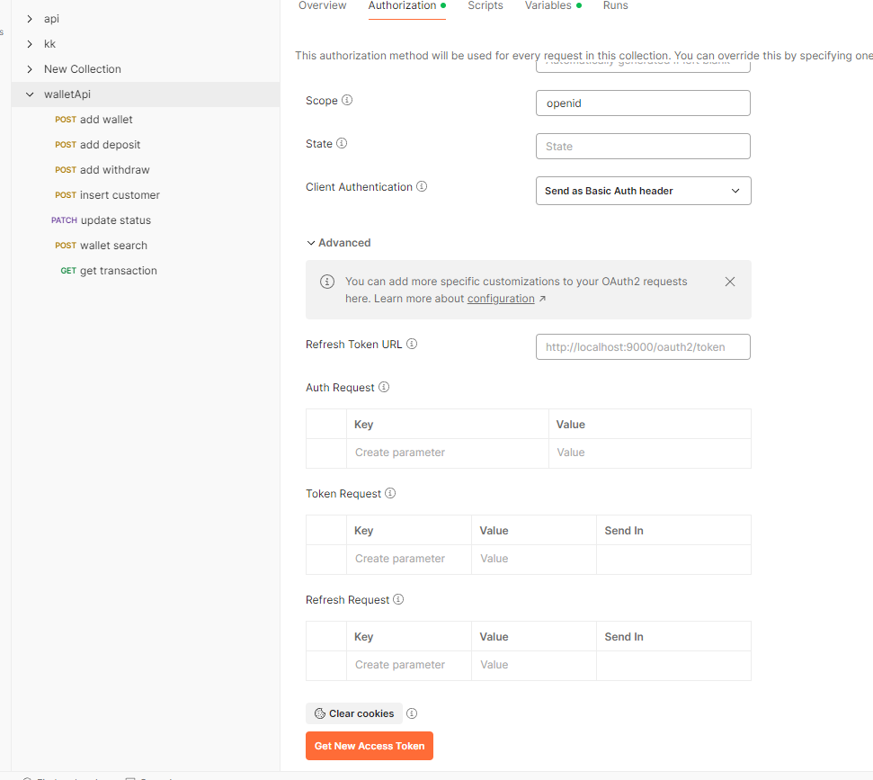
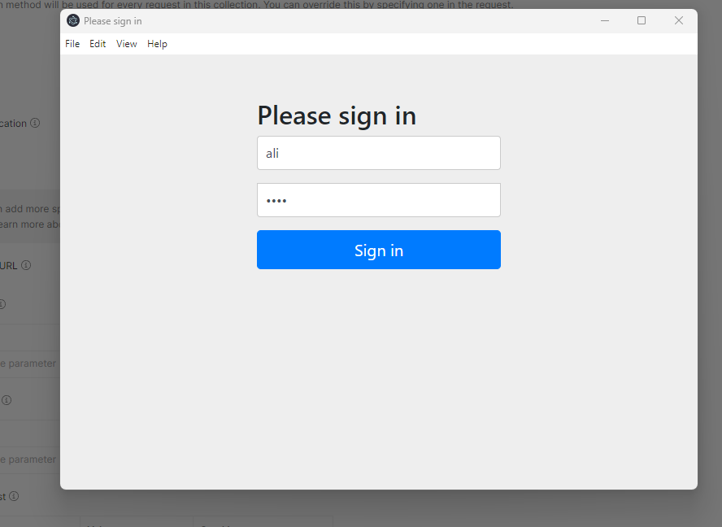
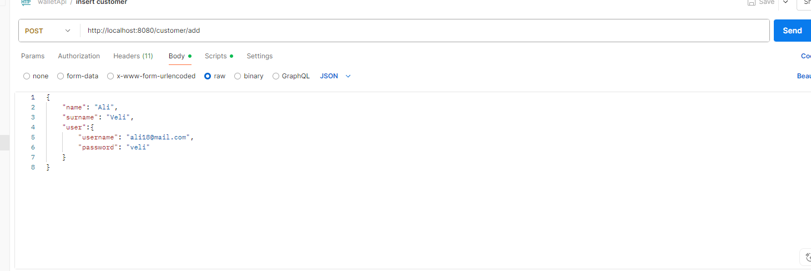
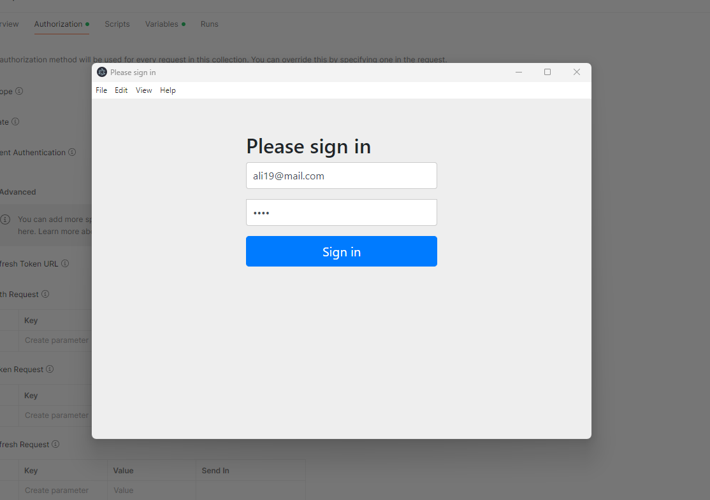
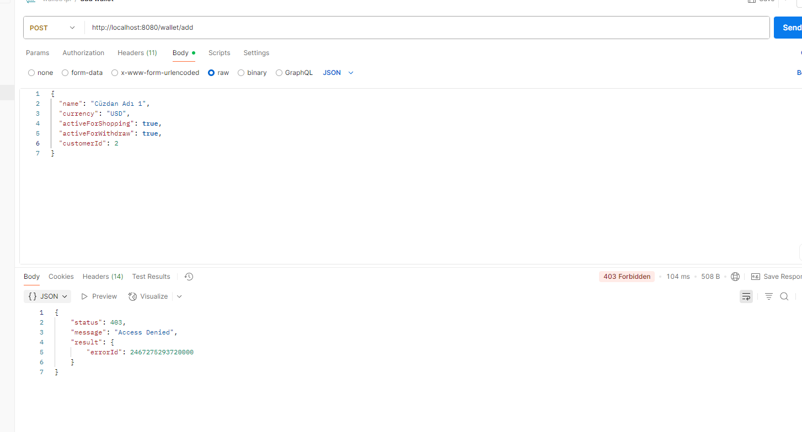
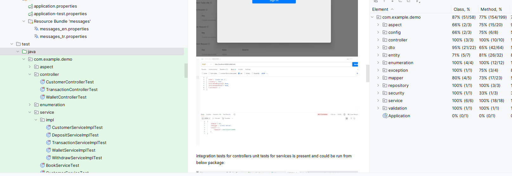
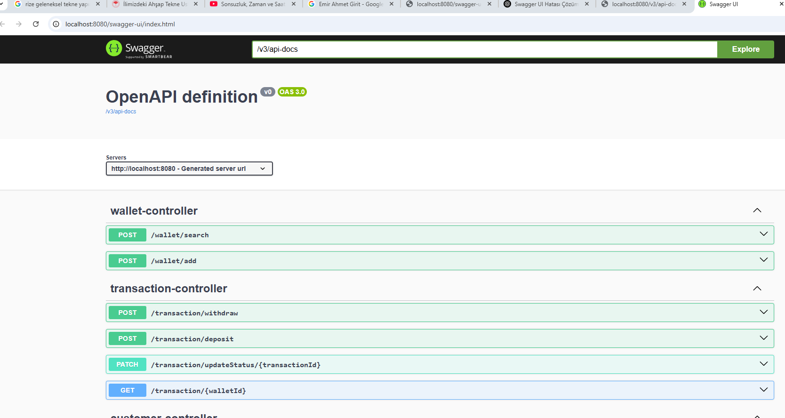
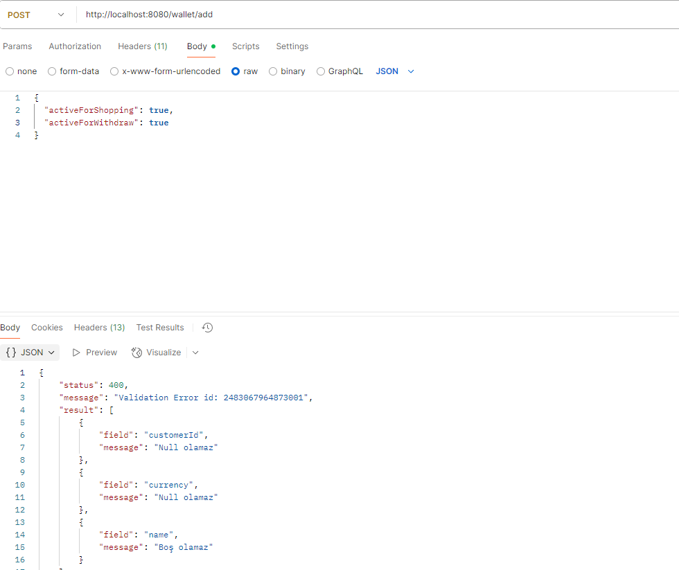

# Digital Wallet Demo Application

This is a demo application simulating a digital wallet.

## Running the Application

1. **Build** the project.
2. Start **AuthServerApplication** first.
3. Then start **BookStoreApplication**.
4. Finally, start the **main Application**.

> **Tip**: You can run these directly within IntelliJ IDEA.

---

## API Testing with Postman

You can import the following Postman collection to test the APIs:

[walletApi.postman_collection.json](additional_content/walletApi.postman_collection.json)

---

### Access Token in Postman

The collection is pre-configured with variables for `access_token`.

- Click **"Get New Access Token"** to obtain a valid token.
- One persisted user exists with the following credentials:
    - **Username:** `user`
    - **Password:** `1234`
    - **Role:** `EMPLOYEE`

After retrieving the token, click **"Use Token"** to apply it to all API requests in the collection.

---

## Usage Flow

1. **First**, create a customer using the *Insert Customer* API.
2. Then you can create wallets and perform transactions with the related APIs.
3. All required payloads are included in the Postman collection and ready to test.

---

## Owner Authorization

After a customer is created, you can also obtain an access token for the customer:

- Before clicking **"Get New Access Token"**, make sure to click **"Clear cookies"** in Postman.
- Use the customer's username and password to obtain a token.
- With this token, the customer will only be able to access their own wallets and transactions.

  

---

## Testing

- **Integration tests** for controllers
- **Unit tests** for services  
  are available under the following package:

These can be executed directly from your IDE.

---

## API Documentation

Swagger UI is available at:

---

## Field Validations

Field validations are handled via **DTO annotations**, making validation rules clear and maintainable:

